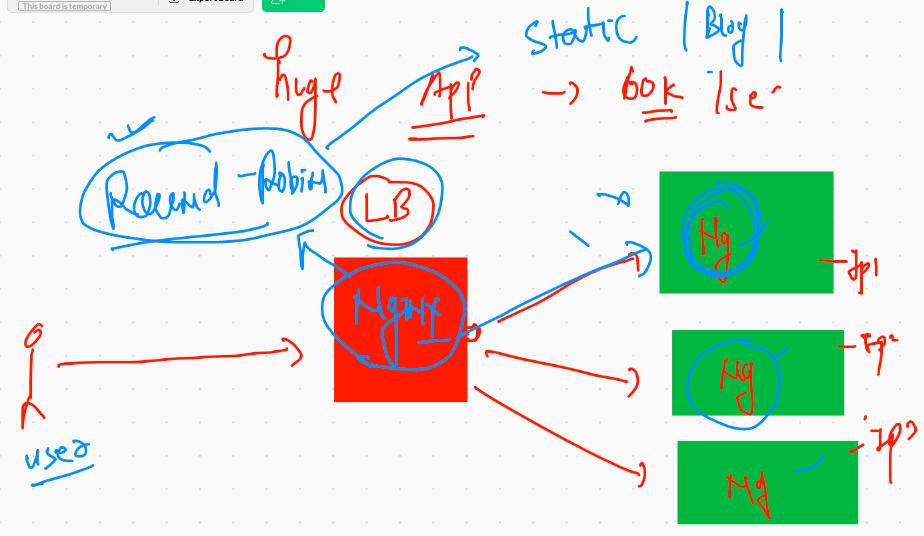

# Nginx day2

## nginx as reverse proxy 


## New nginx server as reverse proxy 

```
[root@vm111 conf.d]# cat  default.conf 
server {
    listen       80;
    server_name  localhost;

    #charset koi8-r;
    #access_log  /var/log/nginx/host.access.log  main;

    location / {
        #root   /usr/share/nginx/html;
        #index  index.html index.htm;
	proxy_pass  http://40.122.25.60;
    }


```

## Nginx as Loadbalancer 

### using Round-Robin algo 



### least-connected & IP-hash 


## configure nginx server as a Load balancer 

```
[root@vm111 conf.d]# cat default.conf 
upstream  ashuapps  {

	#least_conn;  # name of algo supported by nginx default
	ip_hash;
	server  40.122.25.60;  # webservers where traffic will be forwared 
	server  13.67.133.120; 

}


server {
    listen       80;
    server_name  localhost;

    #charset koi8-r;
    #access_log  /var/log/nginx/host.access.log  main;

    location / {
        #root   /usr/share/nginx/html;
        #index  index.html index.htm;
	proxy_pass  http://ashuapps;
    }

```

## SSL in Nginx 


### creating self sing certificates 

```
 cd /etc/ssl/nginx/ashuwebapp
 openssl  req -x509 -nodes -days 365 -newkey rsa:2048  -keyout  ashuapp.key  -out ashuapp.cert
 
 ```
 
