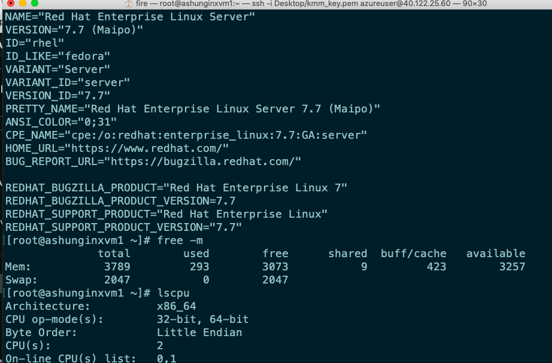

# Web servers 


## tomcat & IIS 


## httpd | tomcat | nginx 


## some official URLs 

[URL official] ('https://www.nginx.com/')

## Docs & GUide 

[docs] ('https://nginx.org/en/docs/')

## Nginx offerings 


## Nginx installation 


## check OS details



## Installation steps 

### check and update rhel if it is having gcc / python based upgrades 

```
yum update -y

```

## install URL 

[install nginx] ('https://nginx.org/en/linux_packages.html')

## creating nginx online repo 

```
[root@ashunginxvm1 ~]# cd  /etc/yum.repos.d/
[root@ashunginxvm1 yum.repos.d]# ls
redhat.repo  rh-cloud-eus.repo
[root@ashunginxvm1 yum.repos.d]# vim  nginx.repo 
[root@ashunginxvm1 yum.repos.d]# 

```

## content of nginx.repo

```


[root@ashunginxvm1 ~]# cat  /etc/yum.repos.d/n.repo 
[nginx]
name=nginx repo
baseurl=https://nginx.org/packages/rhel/7/$basearch/
gpgcheck=0
enabled=1
[root@ashunginxvm1 yum.repos.d]# 

```

## installing 

```
 yum  install nginx -y
 
```

## configuration 

```
[root@ashunginxvm1 ~]# rpm -q  nginx 
nginx-1.18.0-2.el7.ngx.x86_64
[root@ashunginxvm1 ~]# rpm -ql   nginx 
/etc/logrotate.d/nginx
/etc/nginx
/etc/nginx/conf.d
/etc/nginx/conf.d/default.conf
/etc/nginx/fastcgi_params
/etc/nginx/koi-utf
/etc/nginx/koi-win
/etc/nginx/mime.types
/etc/nginx/modules
/etc/nginx/nginx.conf
/etc/nginx/scgi_params
/etc/nginx/uwsgi_params
/etc/nginx/win-utf
/etc/sysconfig/nginx
/etc/sysconfig/nginx-debug
/usr/lib/systemd/system/nginx-debug.service
/usr/lib/systemd/system/nginx.service
/usr/lib64/nginx

```

## nginx options 


## starting nginx 

```
49  systemctl   start  nginx 
   50  systemctl   status  nginx 
   51  systemctl   enable   nginx
   
 ```
 
 
