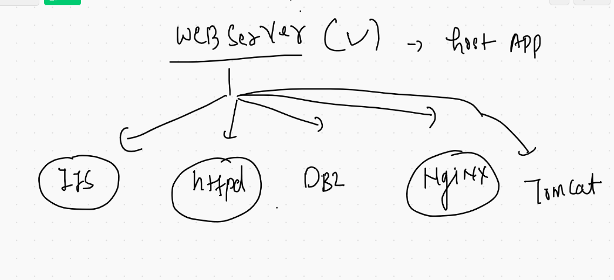
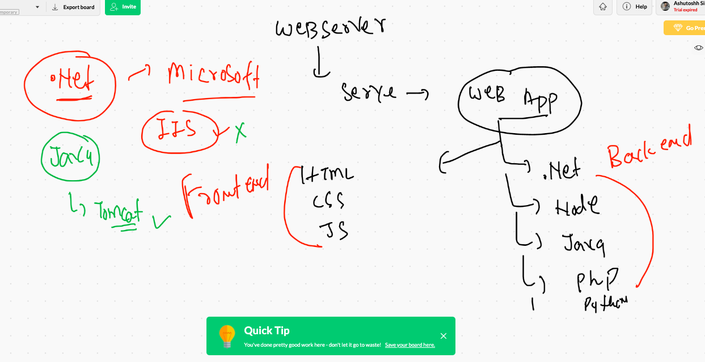
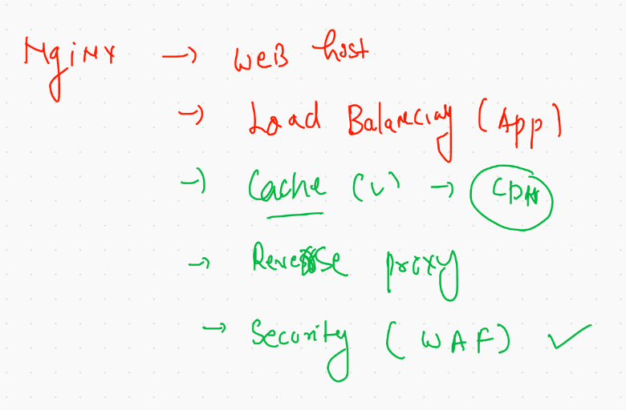
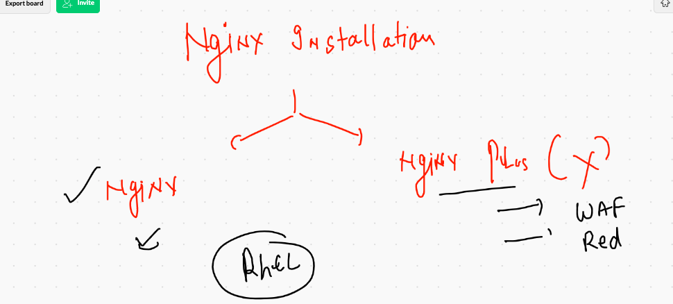

# Web servers 



## tomcat & IIS 



## httpd | tomcat | nginx 


## some official URLs 

[URL official] ('https://www.nginx.com/')

## Docs & GUide 

[docs] ('https://nginx.org/en/docs/')

## Nginx offerings 



## Nginx installation 




## check OS details


## Installation steps 

### check and update rhel if it is having gcc / python based upgrades 

```
yum update -y

```

## install URL 

[install nginx] ('https://nginx.org/en/linux_packages.html')

## creating nginx online repo 

```
[root@ashunginxvm1 ~]# cd  /etc/yum.repos.d/
[root@ashunginxvm1 yum.repos.d]# ls
redhat.repo  rh-cloud-eus.repo
[root@ashunginxvm1 yum.repos.d]# vim  nginx.repo 
[root@ashunginxvm1 yum.repos.d]# 

```

## content of nginx.repo

```
[root@ashunginxvm1 yum.repos.d]# cat  nginx.repo 
[nginx-stable]
name=nginx stable repo
baseurl=http://nginx.org/packages/centos/$releasever/$basearch/
gpgcheck=1
enabled=1
gpgkey=https://nginx.org/keys/nginx_signing.key
module_hotfixes=true
[root@ashunginxvm1 yum.repos.d]# 

```


